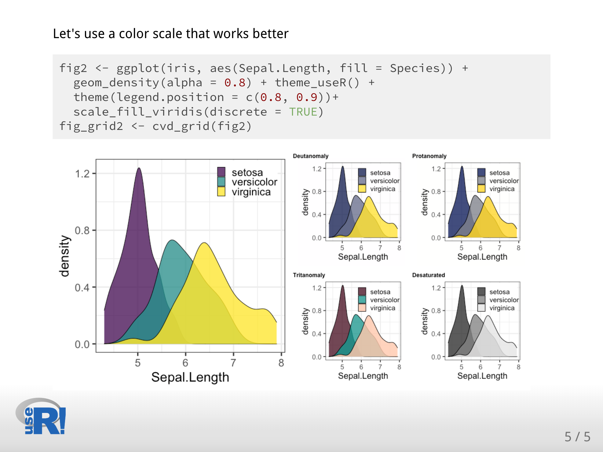

#  Creating xaringan slides using the useR! theme


Welcome to useR, in this repository you will find a template that shows the use of the "useR" xaringan theme. 

## Installation 

I you have not installed the xaringan package, run this command in your RStudio session:

```
if (!requireNamespace("remotes", quietly = TRUE))
    install.packages("remotes")

remotes::install_github("yihui/xaringan")
```

## Creating a presentation

Use the template.Rmd file with the 'useR' and 'useR-fonts' theme to start writing your conference presentation. 

Alternatively, use File > New file > Rmarkdown > From template > Ninja Presentation 
to start editing a new xaringan presentation. 


Add "css: [useR, useR-fonts]" in the YAML header to specify that you want to use the useR and useR-fonts in your presentation.


Here are some captions of how your presentation would looks like:

## We start with a title slide


## You can use up to three header levels to show title and subtitles in your slides


## You can use the chapter slide to separate different sections in your presentation


## Also, you can include some code and results:


## If you are showing ggplot2 plots, we recommend to use the [viridis](https://cran.r-project.org/web/packages/viridis/vignettes/intro-to-viridis.html) package to set colorblind-friendly scales: 



## Please, include Alternative text in your figures to facilitate their interpretation using screen readers.   


